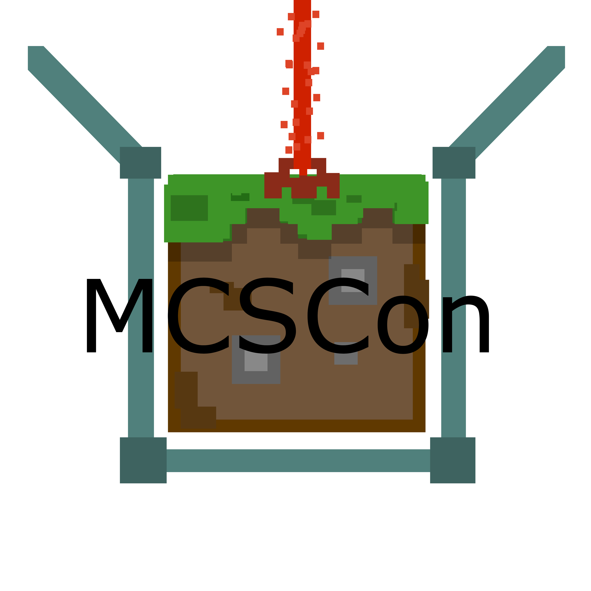

Minecraft Server Container
========================================



Description
----------------------------------------

This repository contains several containers for MCSMan. They
also can be used apart from MCSMan. They store all server data
in `/data` directory inside a container. There are currently
3 types of them.

Containers
----------------------------------------

1. `handtruth/mcscon:latest` -- the default container. It will
   try to find `/data/server.jar` file. If it fails, it will try
   to download the latest version of the Minecraft Server. After
   that it will start the server.
2. `handtruth/mcscon:vanilla` -- the latest Minecraft Server
   version
3. `handtruth/mcscon:spigot` -- the latest Minecraft Server
   Release in spigot. Spigot may be not the latest.

Usage
----------------------------------------

The containers were supposed to be used inside MCSMan, but you
can run them without it like so.
```sh
docker run -d -p 25565:25565 handtruth/mcsman
```

After that you can find a new volume created by Docker, where
server data is stored. Currently, there are no any way to
accept EULA automaticly. So you need to access this volume.

----------------------

For the sake of Rechnoi Serp
